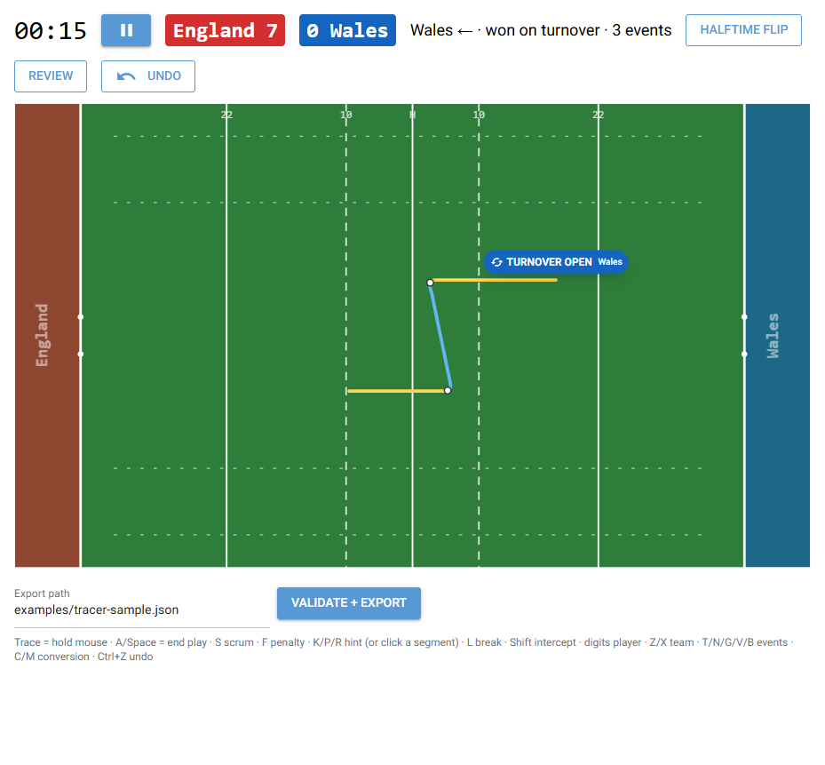
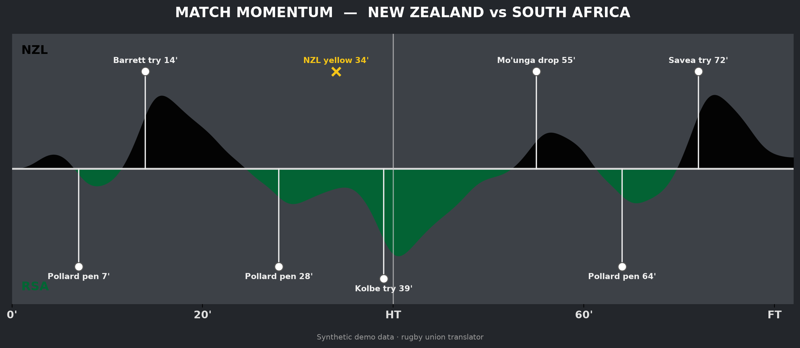

# Match Momentum

[](https://github.com/Jfrusher/match-momentum/actions/workflows/tests.yml)

**Trace a rugby match with your mouse, get a broadcast-style momentum chart out of it.**

You hold the button down and follow the ball for a whole possession, one unbroken line. The app reads the shape of that line, its turns and its distances, and works out where the carries, passes and kicks were. Tapping keys while you drag adds player numbers, linebreaks and scores without breaking the drag. Since the trace already knows the distances and where on the pitch things happened, the momentum weights come from that rather than from a number you typed in afterwards.



*Amber carry, blue pass, red kick. White dots are where the recognizer cut the line.*

Underneath the tracer is a momentum engine that doesn't know what sport it's drawing. Threat events decay exponentially, and what comes out is the mirrored area chart you see on football broadcasts. Football and rugby both work, as translators sitting on top of that engine.



## Quick start

Python 3.11+.

```bash
pip install -e ".[dev]"

# trace a match
python -m tracer.app                 # opens a browser tab (native window if pywebview is installed)
python -m tracer.app 8123            # optional port, default 8080

# chart an event file
python momentum.py examples/tracer-sample.json out.png --sport rugby
python momentum.py examples/events_arg_egy.json out.png --sport football
```

`examples/tracer-sample.json` is an actual tracer export that has been run through the rugby translator, so it doubles as proof that what the tracer writes is what `momentum.py` can read.

## Live Trace

The mechanic, the full hotkey table and the tuning workflow are in [tracer/README.md](tracer/README.md). The short version:

- Hold the mouse button when a possession starts and follow the ball. Pass, run, pass, tackle are all one line.
- Tap `A` or `Space` when the play dies. That, not letting go of the button, is what ends the chain.
- The line redraws colour-coded by inferred action while you go, so you can see what the recognizer thinks.

The recognizer only looks at the shape of the line, never at how fast you drew it. That was deliberate: I wanted to trace off paused or scrubbed video and get the same answer as tracing live. [`tracer/tests/test_pace_invariance.py`](tracer/tests/test_pace_invariance.py) exists to stop that quietly breaking.

Possessions also record how they started (scrum, lineout, penalty, restart, turnover, interception), because in rugby that's a fair chunk of what a possession is worth. Most of it comes off the trace: a kick that ends at the touchline is a lineout, and the kick-to-touch-on-the-full law says where that lineout gets taken. Scrums and penalties are the two a line can't show you, so those are single taps. Whatever gets inferred turns up as a chip on the pitch, and the chip is also how you correct it. With only two teams to pick from, a wrong guess is one click from right.

## The momentum model

Every threat event adds momentum energy for its team, and that energy decays exponentially (half-life around 3 minutes for football, set per sport by the translator):

```
momentum_team(t) = Σ over events e:  w_e · exp(-λ · (t - t_e))   for t ≥ t_e
```

The chart plots net momentum, home minus away, smoothed with a Gaussian kernel, so only one team is above the line at a time. That's how the broadcast graphics do it, and the model was built to reproduce them.

Weighting is where the two sports part company. Football keys off discrete threat events (shot, chance, goal, sustained pressure) through a flat lookup table. Rugby phase play has no equivalent single moment to key off, so [`translators/rugby.py`](translators/rugby.py) works the weight out in code from metres gained, field position and linebreaks.

## Architecture

The decay math and the chart renderer don't know what sport they're drawing. Three independent pieces compose:

```
DataSource.parse()  ->  Sport.translate()  ->  MomentumEngine.compute()  ->  chart.render()
   (raw provider          (raw events ->           (decay + smoothing,        (figure, driven
    format in)              StandardEvent)           sport-agnostic)            by ChartProfile)
```

| Package | Role |
|---|---|
| [`core/`](core/) | `schema.py` holds `StandardEvent`, the only shape the math ever sees. `engine.py` is the decay and smoothing. `chart.py` renders the area chart from a `ChartProfile`. |
| [`translators/`](translators/) | One `BaseSport` per sport: event weighting plus match structure (duration, half-time marker, decay half-life, axis labels). Static weight tables sit alongside as JSON. |
| [`sources/`](sources/) | One `BaseDataSource` per data provider, parsing raw match data into a common shape. Deliberately independent of `translators/`, so any sport works with any source instead of needing a class per (sport, provider) pair. |
| [`tracer/`](tracer/) | The Live Trace app: capture, recognition, review, export. Writes the same JSON the sources read. |

To add a sport, implement `BaseSport` in `translators/`, register it in the `SPORTS` dict in `translators/__init__.py`, and run with `--sport yourname`. [`translators/rugby.py`](translators/rugby.py) is the worked example; its module docstring covers territory-based threat and why cards are markers rather than something fed into the decay sum.

To add a data provider (Opta, StatsBomb, whatever else), implement `BaseDataSource` in `sources/` and map its raw fields into the shape your chosen `Sport.translate()` expects. Nothing downstream changes.

## Tests

225 tests, run on every push and pull request:

```bash
python -m pytest -q
```

The recognizer is gated by a corpus of 39 synthetic trace scenarios in [`tracer/fixtures.py`](tracer/fixtures.py), replayed at baseline config, plus the pace-invariance fence. Every threshold and weight it depends on is a flat constant in [`tracer/config.py`](tracer/config.py). [tracer/TUNING.md](tracer/TUNING.md) covers the loop for moving them (save a trace, promote it with its expected truth, sweep or fit) and where the calibration currently stands.

## Background

This started as a fork of [JakeBonnici22/match-momentum](https://github.com/JakeBonnici22/match-momentum), which rebuilt FIFA's World Cup 2026 broadcast momentum graphic: an exponential-decay model over a hand-built football event stream, checked against published Flashscore graphics. The ARG–EGY match narrative, the validation work and an honest account of the limits of both are all in the [upstream README](https://github.com/JakeBonnici22/match-momentum#readme), and I'd rather link to it than paraphrase it.

Two things took this repo somewhere else. The model isn't really about football, so I pulled the football-specific parts out into the translator and source split above. And the model needs an event stream from somewhere, which is the actual problem: typing one out during a match is slow and you get it wrong. That's what the tracer is for. My first go at it was a keyboard-only React event logger, archived as-is in [`legacy/tagger/`](legacy/tagger/). A keyboard vocabulary can tell you a carry happened but not where it happened, and in rugby where is most of the signal.

## Acknowledgements

Thanks to [Jake Bonnici](https://github.com/JakeBonnici22) for [match-momentum](https://github.com/JakeBonnici22/match-momentum), which this is forked from. The decay and smoothing engine in `core/engine.py`, and the chart it feeds, are his. The rugby translator and the tracer are input layers wrapped around a model that already worked.

## Contributing

See [CONTRIBUTING.md](CONTRIBUTING.md).

## Licence

[MIT](LICENSE).
