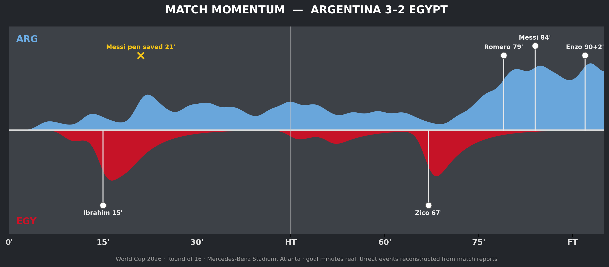
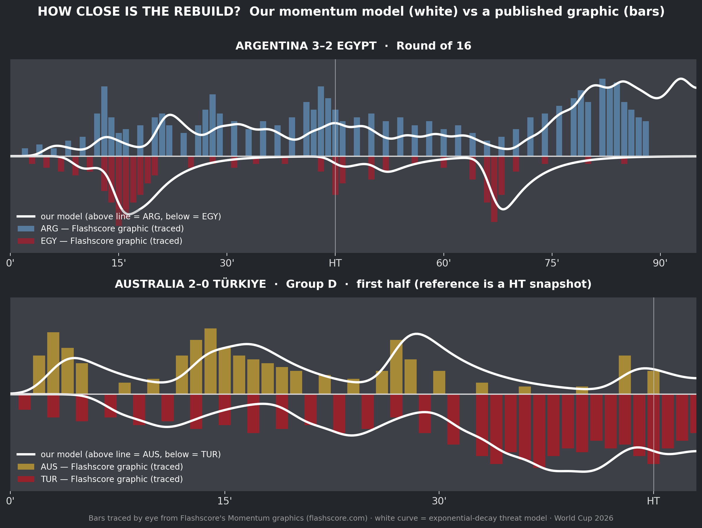

# Match Momentum — rebuilding FIFA's World Cup 2026 broadcast chart

Watching the 2026 World Cup, I kept noticing the **Match Momentum** graphic on the broadcast — a mirrored area chart showing which team is "on top" minute by minute. FIFA doesn't publish the methodology, so I rebuilt it from scratch.



## The match

Argentina 3–2 Egypt, Round of 16, July 7 2026 (Mercedes-Benz Stadium, Atlanta). Egypt led 2–0 in the 75th minute; Argentina became the first team in World Cup history to win a knockout match in regulation after trailing by two that late. Romero 79', Messi 84', Enzo Fernández 90+2'.

The momentum chart makes the story visible in one glance: ~70 minutes of red, then a blue wall.

## The model

Each threat event (shot, chance, goal, sustained pressure) injects "momentum energy" for its team, which **decays exponentially** (half-life ≈ 3 min). Per-minute energy is smoothed with a Gaussian kernel and the two teams are plotted as mirrored fills around a center line — the same visual grammar as the broadcast graphic.

```
momentum_team(t) = Σ over events e:  w_e · exp(-λ · (t - t_e))   for t ≥ t_e
```

## Validation

FIFA doesn't publish its momentum charts as data or standalone images, so validation uses two independent references: Flashscore's published Momentum graphics for the same matches, and a broadcast photo of FIFA's own graphic (AUS–TUR).



Bars = Flashscore's graphic, traced by eye (their snapshots: ARG–EGY at 2–2, AUS–TUR at half-time). White curve = this decay model. Run `python compare.py` to regenerate.

What validation caught: my first ARG–EGY reconstruction assumed Egypt dominated momentum because they led 2–0. Flashscore's chart showed the opposite — Argentina controlled territory throughout while Egypt scored on counters. The event stream was corrected accordingly. Also notable: FIFA's broadcast chart and Flashscore's disagree with *each other* (e.g. Australia's early momentum), because "momentum" has no standard definition — every provider models it differently.

Limitations: two matches, references traced by eye, and event streams calibrated against the same graphics they're compared to — so this demonstrates the model can reproduce the reference shapes, not that it independently replicates any provider's algorithm. A rigorous test needs official event data (Opta/StatsBomb) as input.

## Data honesty

Goal and penalty minutes are real (per ESPN / Sky Sports match reports). The granular event stream (shots, pressure spells) is **reconstructed from match report narratives** to illustrate the model — official event-level data isn't public. Swap in a real event feed (Opta/StatsBomb) via `events.json` and the pipeline works unchanged.

## Run it

```bash
pip install numpy matplotlib scipy
python momentum.py events.json momentum_arg_egy.png
```

Edit `events.json` to chart any match.
